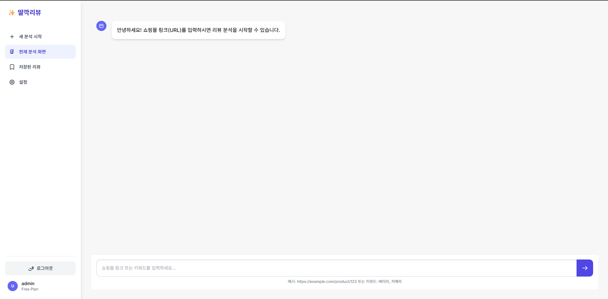

# 딸깍 리뷰 (Review Analyzer)

사용자가 입력한 상품 링크와 관심 키워드를 바탕으로 리뷰를 분석하고, 핵심 장단점을 요약해 주는 웹 서비스입니다.

## 시연 영상

[](https://www.youtube.com/watch?v=s0NdfQGYFL4)

이미지를 클릭하면 YouTube 시연 영상으로 이동합니다.

## 프로젝트 개요

- **프로젝트 목표:** 리뷰 탐색 시간을 줄이고 사용자가 원하는 기준에 맞는 제품 정보를 제공합니다.
- **핵심 기능:** 키워드 기반 리뷰 분석, Gemini 요약, 분석 결과 저장, 개인 라이브러리
- **팀원:**
  - `최정길`: 202110542
  - `이의빈`: 202114228
  - `이유환`: 202111343

## Demo Mode 및 제한사항

쿠팡은 자동화된 브라우저 요청에 `Access Denied`를 반환할 수 있어 실시간 리뷰 수집이 항상 재현되지는 않습니다. 이는 서비스의 접근 정책과 자동화 탐지 환경에 따라 달라질 수 있습니다.

재현 가능한 시연을 위해 `DEMO_MODE=true`에서는 사전에 수집하고 식별 정보를 제거한 하늘보리 리뷰 데이터를 사용합니다. Demo Mode는 **리뷰 수집 단계만 대체**하며, 키워드 추출, Gemini 분석, 결과 표시 및 DB 저장 흐름은 실제 기능과 동일하게 실행됩니다.

`DEMO_MODE=false`로 변경하면 Selenium 기반 실시간 수집을 시도하지만, 쿠팡의 접근 제한으로 실패할 수 있습니다. 이 프로젝트는 해당 제한을 우회하거나 실시간 크롤링 성공을 보장하지 않습니다.

## 기술 스택

- **Backend:** Python 3.11, Flask
- **Frontend:** HTML, Tailwind CSS, JavaScript
- **Database:** MySQL
- **Crawling:** Selenium, pandas
- **AI:** Google Gemini Interactions API (`google-genai`)

## 실행 방법

### 1. 가상 환경 구성

PowerShell에서 프로젝트 루트로 이동한 뒤 실행합니다.

```powershell
py -3.11 -m venv .venv
.\.venv\Scripts\Activate.ps1
$env:PYTHONUTF8="1"
pip install -r requirements.txt
```

### 2. 환경 변수 설정

예시 파일을 복사한 뒤 `.env`에 실제 DB 접속 정보와 Gemini API 키를 입력합니다.

```powershell
Copy-Item .env.example .env
```

```dotenv
SECRET_KEY=change-me
DB_HOST=127.0.0.1
DB_PORT=3306
DB_USER=root
DB_PASSWORD=your-password
DB_NAME=review_analyzer_db
GOOGLE_API_KEY=your-api-key
DEBUG=true
DEMO_MODE=true
```

`.env`는 Git에 포함되지 않습니다.

### 3. 데이터베이스 생성

MySQL 서버를 실행한 뒤 `review_analyzer/db/schema.sql`을 MySQL Workbench에서 실행하거나 다음 명령을 사용합니다.

```powershell
mysql -u root -p < review_analyzer/db/schema.sql
```

### 4. 서버 실행

```powershell
.\run_demo.bat
```

또는 활성화된 가상 환경에서 직접 실행할 수 있습니다.

```powershell
python run.py
```

브라우저에서 `http://127.0.0.1:5000`에 접속합니다.

## 시연 순서

1. 상품 URL을 입력합니다.
2. 분석 키워드를 쉼표로 구분해 입력합니다. 예: `맛, 향, 가성비`
3. Gemini가 생성한 전체 요약과 키워드별 분석을 확인합니다.
4. 로그인 후 결과를 개인 라이브러리에 저장합니다.

Demo Mode에서는 입력한 URL을 분석 결과의 식별 및 저장에 사용하고, 리뷰 본문은 포함된 하늘보리 데모 데이터를 사용합니다.

## 폴더 구조

```text
Review-Analyzer/
├─ review_analyzer/
│  ├─ ai/              # Gemini 분석
│  ├─ crawling/        # Selenium 수집 및 유사 상품 탐색
│  ├─ db/              # DB 접근 및 스키마
│  ├─ demo_data/       # 식별 정보를 제거한 시연 데이터
│  ├─ static/          # CSS, JavaScript
│  └─ templates/       # HTML 템플릿
├─ .env.example
├─ config.py
├─ requirements.txt
├─ run.py
└─ run_demo.bat
```
